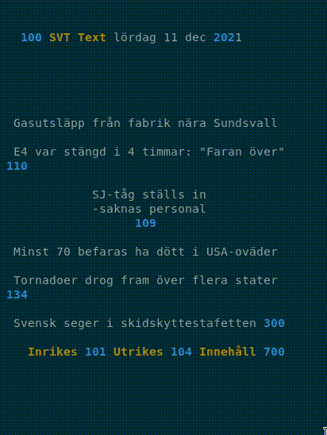

# SVT Text CLI

Read Swedish news from SVT Text in the terminal. Fetching and parsing directly from https://www.svt.se/text-tv.

**Work in progress. Compile and run as you like at moment using the go cli**

## Example

**Interactive mode with colors**



## Usage

```sh
$ svttext --help
Usage: svttext [OPTION]... [PAGE]
Read news from SVT Text

Example: svttext --colors 100

Options:
  -colors
        colorize the output
  -interactive
        start interactive mode
        use arrow keys to navigate pages
        or enter page number to go to page
```

## TODO

- [ ] Make release, github action
- [x] Colorize output, add flag `--color`
- [x] Interactive mode, add a flag `--interactive` and don't exit the cli instead give options like enter new page, navigate with arrow keys, vi key binding etc.
- [ ] Add SVT logo? The "TV" version have a logo at the start page. Maybe add this as ascii art?
